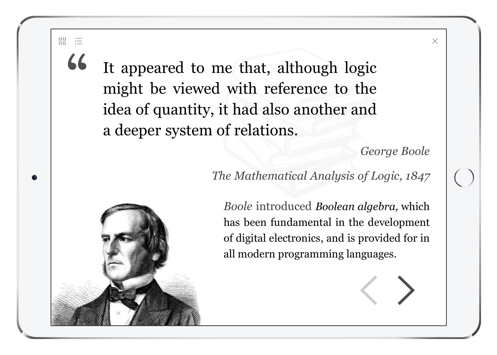
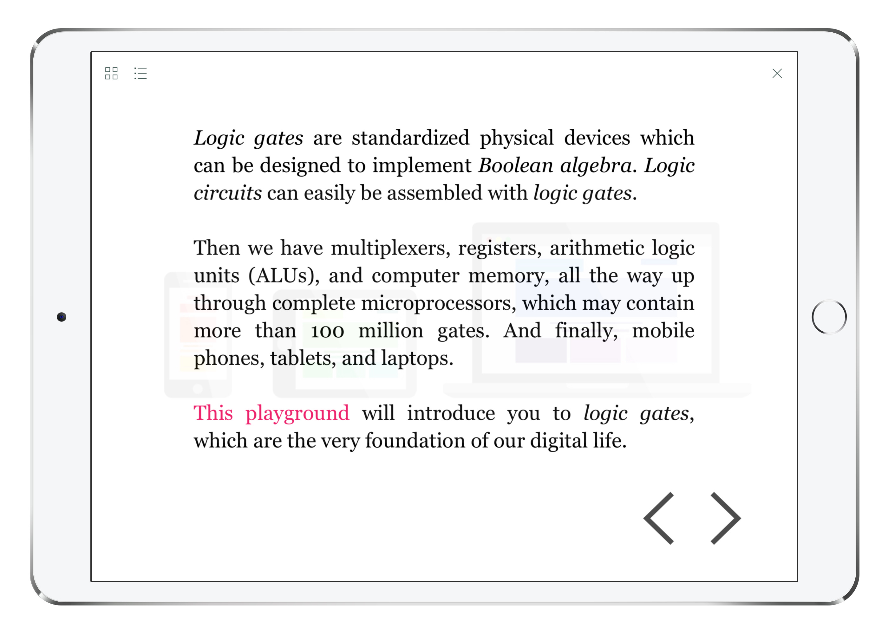
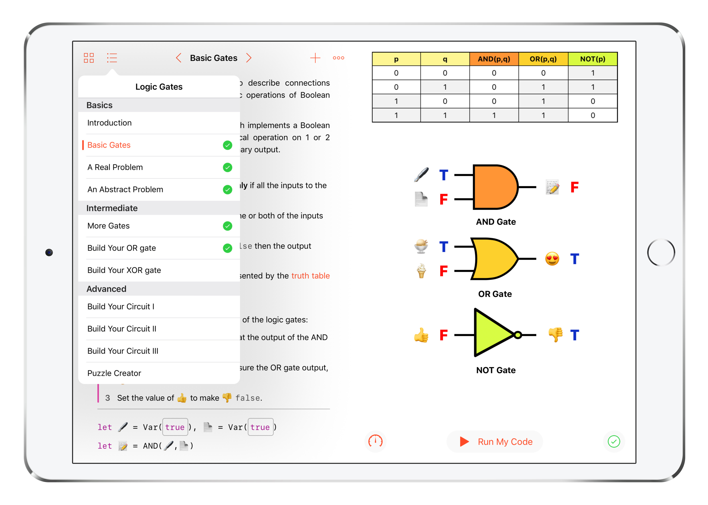
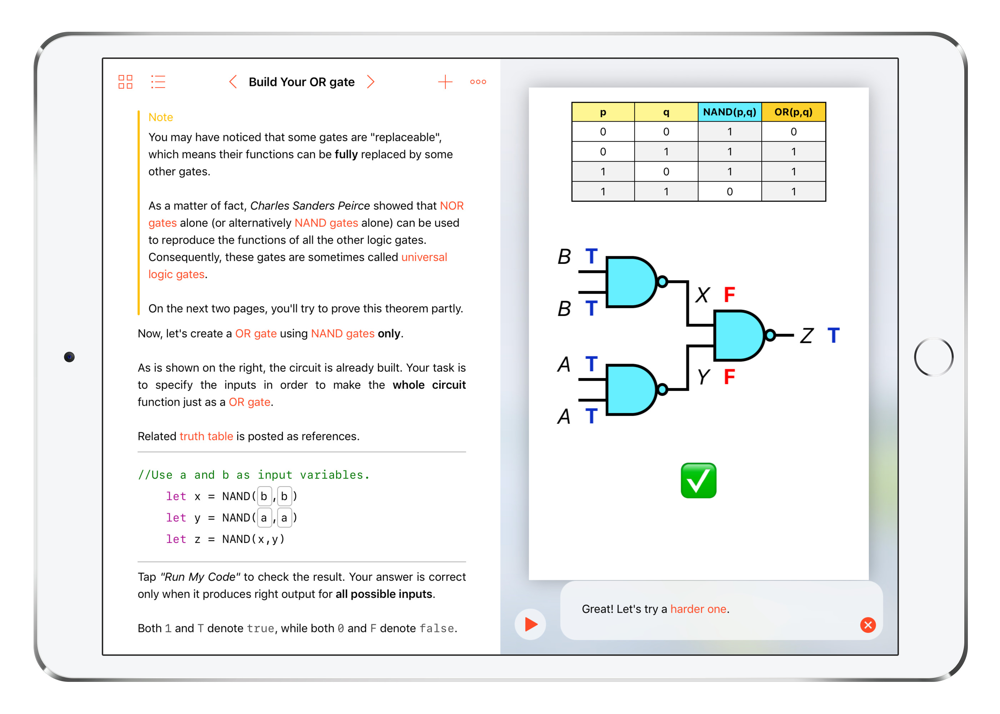

# Application Essay

This playground book introduces logic gates and logic design using several puzzles with guidance. The puzzles are not only interesting Boolean logic games but are also organized to convey philosophies of electronic engineering.

The motivation for creating this particular playground can be divided into two parts.

Firstly, I love things which are structurally organized and free to compose. Such things provide people with possibilities of rational design and achieve effortless elegance, such as logic gates, Markdown, and Swift Playground Books. As a matter of fact, programming itself is such a thing. I think that’s why it fascinates and motivates me all through the years. Another reason is the fact that an increasing number of computer science majors (myself included) only care about codes, algorithms, and software. We tend to neglect some basic aspects of computer science, such as digital circuits, computer organization and architecture, etc. Although we may not deal with them frequently, they are fundamental to everything we build with code, they are actually cool and fun to play with, and they provide us with insights and philosophies of engineering. This is something I try to convey using this playground book.

In the first chapter, the playground introduces basic logic gates. At the beginning, their functions are demonstrated using the emojis. Logic gates can be connected to express logical relationships, which can be described using truth tables. The idea of "all inputs" is visualized using animations.

In the second chapter, more gates are introduced, and the circuits become much more sophisticated. Then comes an important theorem that NAND gates and NOR gates are universal logic gates, which brings an important engineering principle: substitution. We can build something we don't have using something we have, or replace something complex with something simple, as long as they are functionally equivalent. In practical electronic engineering, such substitution is everywhere. Animations are used to imply input transition and to help understand cascading logic gates.

The third chapter consists of the "build-your-circuit" puzzles, which is my favorite part. These problems are interesting and quite tricky. Each gate is assigned a "cost" and every puzzle has a "budget". The player does logical simplification to reduce the cost. It shows the importance of "substitution" in practice. Engineering is the art under realistic constraints, as is well exemplified by this chapter. Users can insert columns into the truth table to inspect variables, and when the truth table becomes too wide, a scroll bar will be created. While scrolling, the leftmost 5 columns are fixed for a better user experience. Also, a puzzle creator is attached so the users can create their own puzzles.

In general, technologies used in this playground include UIKit, Core Graphics, and PlaygroundSupport. The drawing, layout, and animations are implemented using UIKit and Core Graphics. Many features of Playground Book are used to create a rich, interactive environment, such as glossary, hints, placeholder tokens, customized code completions, cutscene page, and LiveViews. The CFRunLoop objects are used to manage asynchronous callbacks.
